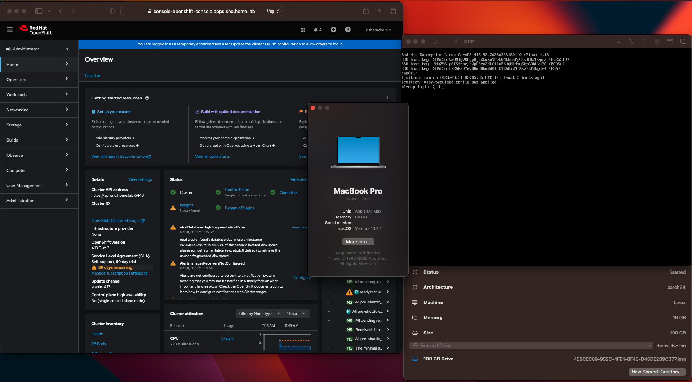
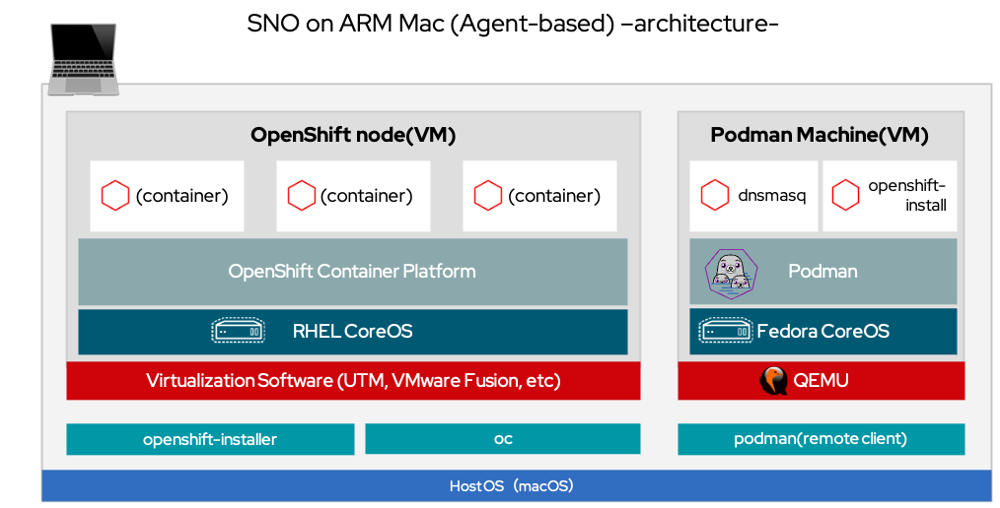
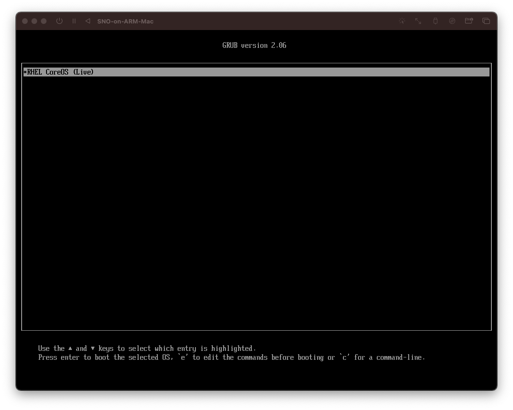
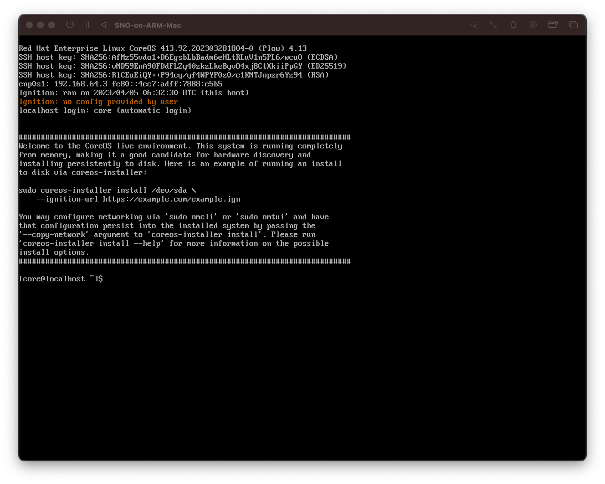
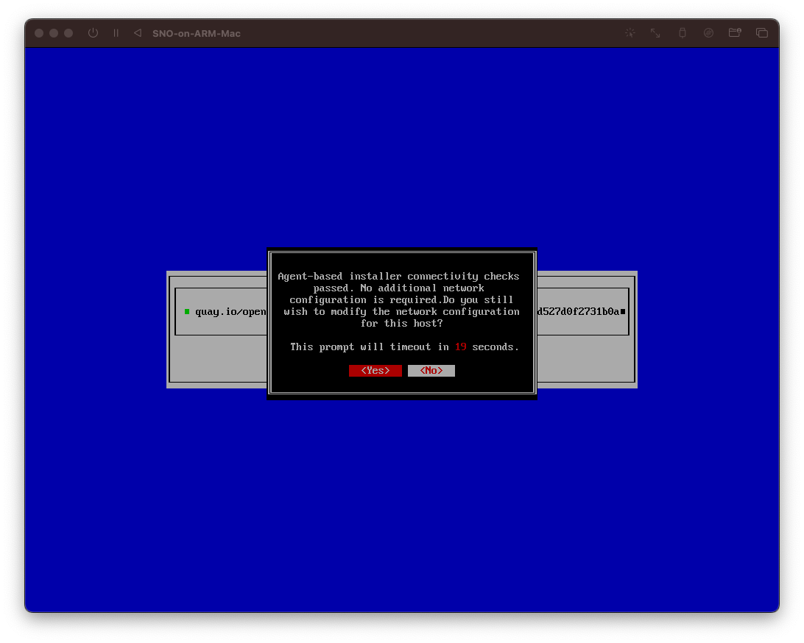
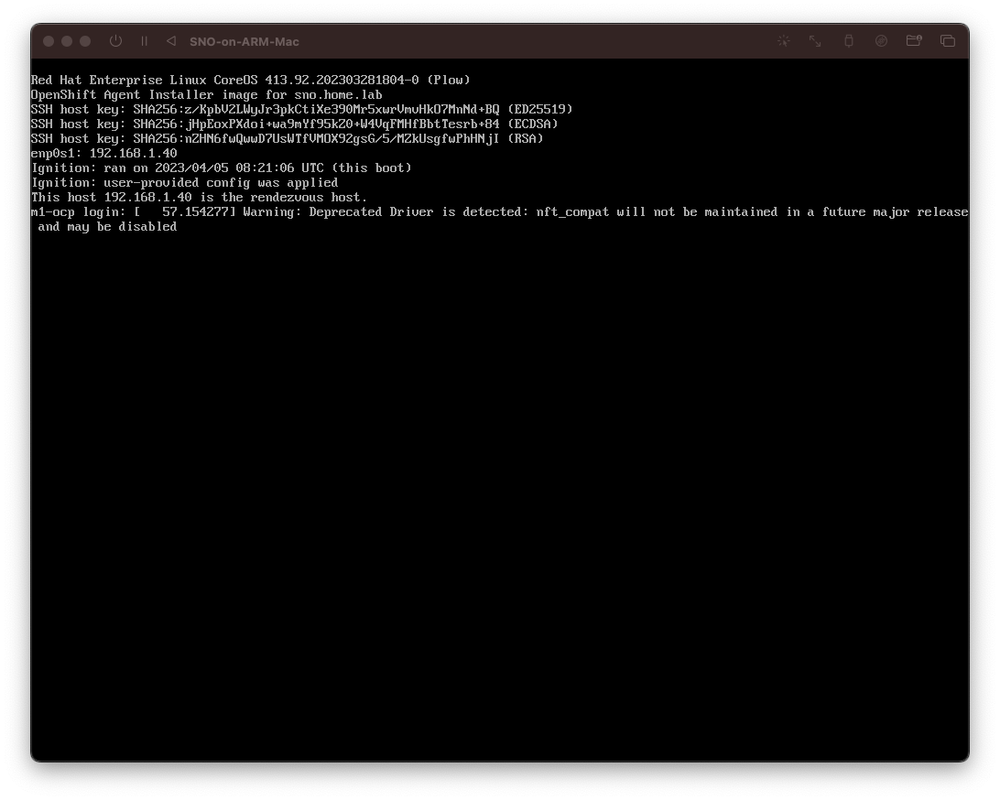

# Single Node OpenShift on ARM Mac

Install Single Node OpenShift on Apple Silicon-based Mac (ARM Mac)

(*) This content is for verification purposes only and does not guarantee use in a production environment or official support.

## Installation Method
- Agent-based install(Recommended): This document. See below.
- UPI: See [sno-upi.md](docs/sno-upi.md).
- Assisted Installer: See [sno-ai.md](docs/sno-ai.md).

Installation Results (on 31/May/2023)
| Method| 4.13.0-rc.0| 4.13.0-rc.2| 4.13.0-rc.3| 4.13.0-rc.4| 4.13.0-rc.5| 4.13.0-rc.6| 4.13.0-rc.7| 4.13.0|
|:-|:-|:-|:-|:-|:-|:-|:-|:-|
| Agent-based install| NG| OK| NG| NG| OK| OK| OK| OK|
| UPI| OK| OK| OK| OK| OK| OK| OK| OK|
| Assisted Installer| NG| NG| NG| NG| NG(*1)| OK| OK| OK|

(*1)https://issues.redhat.com/browse/OCPBUGS-12475

## Prerequisites
- Podman Desktop
- Virtualization software(e.g. UTM, VMware Fusion)
- OpenShift version: after 4.13.0-rc.2

## Sample Parameters
**Network**

| Item| Description| Example Value|
|:-|:-|:-|
| Static IP Address 1| IP address of the Mac host| 192.168.1.150|
| Static IP Address 2| IP address of the OpenShift node| 192.168.1.40|
| Network Address| IP network block in CIDR notation| 192.168.1.0/24|
| Default Gateway| Gateway to the public network| 192.168.1.1|

**Domain and Cluster Name**

| Item| Description | Example Value |
|:-|:-|:-|
| Domain|  <base_domain>| home.lab|
| Cluster Name| <cluster_name>| sno|

**Required DNS Records**

| Item| Description | Example Value |
|:-|:-|:-|
| Kubernetes API| api.<cluster_name>. <base_domain>| api.sno.home.lab|
| Kubernetes API（Internal）| api-int.<cluster_name>. <base_domain>| api-int.sno.home.lab|
| Application Ingress traffic| *.apps.<cluster_name>. <base_domain>| *.apps.sno.home.lab|
| OpenShift node| <host_name>. <cluster_name>. <base_domain>| m1-ocp.sno.home.lab|

**Virtual machine**

[Samples for UTM]

| Item| Sample value|
|:-|:-|
| CPU(Cores)| 8|
| Memory(MB)| 16384|
| Storage(GB)| 120　(*Cannot install if less than 120)|
| Use Apple Virtualization| On|


## Architecture (for Agent-based install)



## How to install (for Agent-based install)

Install Single Node OpenShift with Agent-based on Apple Silicon-based Mac (ARM Mac)

Reference document: [Installing a OpenShift Container Platform cluster with the Agent-based Installer](https://docs.openshift.com/container-platform/4.12/installing/installing_with_agent_based_installer/installing-with-agent-based-installer.html)


### 1. Clone this Git repository
```
git clone https://github.com/tnk4on/sno-on-arm-mac.git
cd sno-on-arm-mac
```

### 2. Get the OpenShift Installer and OpenShift CLI
```
export OCP_VERSION=4.13.0-rc.2
export ARCH=aarch64
mkdir src
cd src
curl -LO https://mirror.openshift.com/pub/openshift-v4/$ARCH/clients/ocp/${OCP_VERSION}/openshift-install-mac.tar.gz
curl -LO https://mirror.openshift.com/pub/openshift-v4/$ARCH/clients/ocp/${OCP_VERSION}/openshift-client-mac.tar.gz
tar zxf openshift-install-mac.tar.gz
tar zxf openshift-client-mac.tar.gz
sudo cp openshift-install oc /usr/local/bin/
cd ..
```

### 3. Get the RHCOS ISO (for use only in test boot)

```
mkdir iso
export ISO_URL=$(openshift-install coreos print-stream-json | grep location | grep $ARCH | grep iso | cut -d\" -f4)
curl -L $ISO_URL -o iso/rhcos-live.iso
```

### 4. Run the DNS server

#### (1) Change Podman machine to root mode

```
podman machine stop
podman machine set --rootful
podman machine start
```

#### (2) Stop `systemd-resolved` on Podman machine

```
podman machine ssh sed -r -i.orig 's/#?DNSStubListener=yes/DNSStubListener=no/g' /etc/systemd/resolved.conf
podman machine ssh systemctl restart systemd-resolved
podman machine ssh ss -ltnup
```

#### (3) Modify the dnsmasq.conf

[Sample: dnsmasq.conf]
```
user=root
port= 53
expand-hosts
log-queries
log-facility=-
local=/home.lab/
domain=home.lab
address=/apps.sno.home.lab/192.168.1.40
address=/api.sno.home.lab/192.168.1.40
address=/api-int.sno.home.lab/192.168.1.40
address=/m1-ocp.sno.home.lab/192.168.1.40
ptr-record=40.1.168.192.in-addr.arpa,m1-ocp.sno.home.lab
rev-server=192.168.1.0/24,127.0.0.1
```

#### (4) Run container
The container image utilizes what is being used in OpenShift Local.
```
podman run -d --rm -p 53:53/udp -v ./dnsmasq.conf:/etc/dnsmasq.conf --name dnsmasq quay.io/crcont/dnsmasq:latest
```

### 5. Change the Mac host system settings

#### (1) /etc/resolver
```
sudo tee /etc/resolver/sno.home.lab &>/dev/null <<EOF
nameserver 127.0.0.1
EOF
```

#### (2) /etc/hosts
```
sudo tee -a /etc/hosts &>/dev/null <<EOF
192.168.1.40    api.sno.home.lab
EOF
```

### 6. Test boot of the RHCOS ISO and confirmation the device names
Create a virtual machine for the OpenShift node in the virtualization software.
After creating the virtual machine, boot it from the RHCOS ISO.


After starting RHCOS-live-mode, check the Storage device name and NIC name.

```
sudo fdisk -l
ip a
```

(Reference)
- NIC: `enp0s1`(UTM), `ens160`(VMware Fusion)
- Storage Device: `/dev/vda`(UTM), `/dev/nvme0n1`(VMware Fusion NVMe), `/dev/sda`(VMware Fusion SATA)

### 7. Update the install-config.yaml

[Sample `install-config.yaml`]

```
apiVersion: v1
baseDomain: home.lab
compute:
- name: worker
  replicas: 0
controlPlane:
  name: master
  replicas: 1
metadata:
  name: sno
networking:
  clusterNetworks:
  - cidr: 10.128.0.0/14
    hostPrefix: 23
  machineNetwork:
  - cidr: 192.168.1.0/24
  networkType: OVNKubernetes
  serviceNetwork:
  - 172.30.0.0/16
platform:
  none: {}
bootstrapInPlace:
  installationDisk: /dev/vda
pullSecret: '{"auths":...}' 
sshKey: 'ssh-ed25519 AAAA...'
```

#### (1) Installation disk
Set the value of `installationDisk:` to match the storage device name confirmed in the previous step.
```
bootstrapInPlace:
  installationDisk: /dev/vda
```

#### (2) Pull secret
Download your installation pull secret from the [Red Hat OpenShift Cluster Manager](https://console.redhat.com/openshift/install/pull-secret). And set the value of `pullSecret: ` to the pull secret.
```
pullSecret: '{"auths":...}' 
```

#### (3) SSH key
Reference document: [Generating a key pair for cluster node SSH access](https://docs.openshift.com/container-platform/4.12/installing/installing_platform_agnostic/installing-platform-agnostic.html#ssh-agent-using_installing-platform-agnostic)

Set the value of `sshKey:` to the public SSH key
```
sshKey: 'ssh-ed25519 AAAA...'
```

### 8. Update the install-config.yaml

[Sample `agent-config.yaml`]
```
apiVersion: v1alpha1
kind: AgentConfig
metadata:
  name: sno
rendezvousIP: 192.168.1.40
hosts: 
  - hostname: m1-ocp
    interfaces:
      - name: enp0s1
        macAddress: 6a:75:4d:0c:7e:a5
    rootDeviceHints: 
      deviceName: /dev/vda
    networkConfig: 
      interfaces:
        - name: enp0s1
          type: ethernet
          state: up
          mac-address: 6a:75:4d:0c:7e:a5
          ipv4:
            enabled: true
            address:
              - ip: 192.168.1.40
                prefix-length: 24
            dhcp: false
      dns-resolver:
        config:
          server:
            - 192.168.1.150
      routes:
        config:
          - destination: 0.0.0.0/0
            next-hop-address: 192.168.1.1
            next-hop-interface: enp0s1
            table-id: 254
```

#### (1) Rendezvous IP
Set the same IP address as the OpenShift node for the Rendezvous IP, since it is a single node configuration.

#### (2) Network Settings
- `hostname:` Set the hostname of the OpenShift node.
- `macAddress:`, `mac-address:` Set the MAC address of the NIC. Check during RHCOS test boot or in the virtualization software. There are two locations.
- NIC name: Enter the confirmed NIC name. There are three locations.

```
hosts: 
    interfaces:
      - name: enp0s1
```
```
   networkConfig: 
      interfaces:
        - name: enp0s1
```
```
            next-hop-interface: enp0s1
```
- DNS Server: To use the DNS server that was run in a container, set the IP address of the ARM Mac host.

```
      dns-resolver:
        config:
          server:
            - 192.168.1.150
```
- `next-hop-address: `：Set the IP address of the default gateway.

#### (3) Root device hints
Set the confirmed storage device name in the root device hints.
```
    rootDeviceHints: 
      deviceName: /dev/vda
```


### 9. Building the container image for creating the agent ISO
There is no NMState for Mac, so we need to create a Linux-based container image with openshift-install and NMState installed in it to create the agent ISO inside it.

#### Containerfile

```
# Preparation Build
FROM quay.io/centos/centos:stream9-minimal as prep

# ARG
ARG VERSION

# ENV 
ENV VERSION=${VERSION}
ENV ARCH=aarch64

# Download binary
RUN microdnf install tar gzip -y 
RUN curl -LO https://mirror.openshift.com/pub/openshift-v4/${ARCH}/clients/ocp/${VERSION}/openshift-install-linux.tar.gz
RUN curl -LO https://mirror.openshift.com/pub/openshift-v4/${ARCH}/clients/ocp/${VERSION}/openshift-client-linux.tar.gz
RUN tar xzf openshift-install-linux.tar.gz
RUN tar xzf openshift-client-linux.tar.gz

# Build image
FROM quay.io/centos/centos:stream9-minimal as build

RUN microdnf update -y \
&& microdnf install nmstate -y \
&& microdnf clean all

COPY --from=prep openshift-install /usr/local/bin
COPY --from=prep oc /usr/local/bin

ENTRYPOINT ["/usr/local/bin/openshift-install"]
```

#### Build the container image
Build by specifying the OpenShift version in the build arguments.

```
export OCP_VERSION=4.13.0-rc.2
podman build -f agent-based/Containerfile -t openshift-install --build-arg VERSION=${OCP_VERSION}
```

Test run.
```
podman run -it --rm openshift-install version
```

### 10. Creating the agent ISO
Create an installation directory and cache directories where images, tools, etc. will be stored. Copy `install-config.yaml` and `agent-config.yaml` to the installation directory, and use the built `openshift-install` container image to create the agent ISO.

```
mkdir -p ocp image_cache files_cache
cp agent-based/*.yaml ocp
podman run --privileged --rm \
    -v $PWD:/data \
    -v ./image_cache:/root/.cache/agent/image_cache \
    -v ./files_cache:/root/.cache/agent/files_cache \
    -w /data openshift-install:latest \
     --dir ocp agent create image
```


The directory structure after creating the agent ISO is as follows.
```
.
├── files_cache
│   ├── agent-tui
│   └── libnmstate.so.1.3.3
├── image_cache
│   └── coreos-aarch64.iso
└── ocp
    ├── .openshift_install.log
    ├── .openshift_install_state.json
    ├── agent.aarch64.iso
    ├── auth
    │   ├── kubeadmin-password
    │   └── kubeconfig
    └── rendezvousIP
```
- The log for creating the agent ISO is generated in `ocp/.openshift_install.log`. If installation does not succeed, please check the log.

### 11. Boot the agent ISO

Start the virtual machine using the `agent.aarch64.iso` created under the installation directory. After the ISO is booted, the installation of the cluster will start automatically.

After a while, a screen like the following will be displayed. If the network connection is confirmed, you can choose whether to make further configuration changes. Since it has already been configured in `agent-config.yaml`, there is no need to change it. If you leave it as is, the installation will continue automatically.




#### Automatic reboot during installation
During the automatic execution of the installation, the system will reboot twice at the following times.

- 1st: ISO start → After completion of writing to disk
- 2nd: Bootstrap start → after Bootstrap completion

#### Installation status monitoring

```
export KUBECONFIG=ocp/auth/kubeconfig
openshift-install --dir=ocp agent wait-for bootstrap-complete
```
- `wait-for bootstrap-complete` from ISO startup to Bootstrap completion.

[Sample: bootstrap log]

```
INFO Waiting for cluster install to initialize. Sleeping for 30 seconds 
~~~~~~
INFO Waiting for cluster install to initialize. Sleeping for 30 seconds 
INFO Cluster is not ready for install. Check validations 
WARNING Cluster validation: The cluster has hosts that are not ready to install. 
WARNING Host m1-ocp validation: Host couldn't synchronize with any NTP server 
WARNING Host m1-ocp: updated status from discovering to insufficient (Host cannot be installed due to following failing validation(s): Host couldn't synchronize with any NTP server) 
INFO Host m1-ocp: updated status from insufficient to known (Host is ready to be installed) 
INFO Cluster is ready for install                 
INFO Cluster validation: All hosts in the cluster are ready to install. 
INFO Preparing cluster for installation           
INFO Host m1-ocp: updated status from known to preparing-for-installation (Host finished successfully to prepare for installation) 
INFO Host m1-ocp: New image status quay.io/openshift-release-dev/ocp-v4.0-art-dev@sha256:250b5a39dd30e13afcdcefdfa99586811b438c3e6dc9df350f9a4132188d4fe6. result: success. time: 7.04 seconds; size: 438.75 Megabytes; download rate: 65.31 MBps 
WARNING Host's disk /dev/disk/by-path/pci-0000:00:05.0 is slower than the supported speed, and may cause degraded cluster performance (fdatasync duration: 21 ms) 
INFO Host m1-ocp: updated status from preparing-for-installation to preparing-successful (Host finished successfully to prepare for installation) 
INFO Cluster installation in progress             
INFO Host m1-ocp: updated status from preparing-successful to installing (Installation is in progress) 
INFO Host: m1-ocp, reached installation stage Installing: bootstrap 
INFO Host: m1-ocp, reached installation stage Waiting for bootkube 
INFO Bootstrap Kube API Initialized               
INFO Host: m1-ocp, reached installation stage Writing image to disk 
INFO Host: m1-ocp, reached installation stage Writing image to disk: 11% 
INFO Host: m1-ocp, reached installation stage Writing image to disk: 24% 
INFO Host: m1-ocp, reached installation stage Writing image to disk: 36% 
INFO Host: m1-ocp, reached installation stage Writing image to disk: 49% 
INFO Host: m1-ocp, reached installation stage Writing image to disk: 61% 
INFO Host: m1-ocp, reached installation stage Writing image to disk: 66% 
INFO Host: m1-ocp, reached installation stage Writing image to disk: 77% 
INFO Host: m1-ocp, reached installation stage Writing image to disk: 88% 
INFO Host: m1-ocp, reached installation stage Writing image to disk: 94% 
INFO Host: m1-ocp, reached installation stage Writing image to disk: 100% 
INFO Bootstrap configMap status is complete       
INFO cluster bootstrap is complete                
```

#### Confirm Completion of Installation
Run the following command to confirm that the cluster installation is complete.

```
openshift-install --dir=ocp wait-for install-complete
```

The password for `kubeadmin` can be found in the log output after the installation is complete.
```
~~~~
INFO Install complete!                            
INFO To access the cluster as the system:admin user when using 'oc', run 'export KUBECONFIG=/Users/*****/***/ocp-on-arm-mac/ocp/auth/kubeconfig' 
INFO Access the OpenShift web-console here: https://console-openshift-console.apps.sno.home.lab 
INFO Login to the console with user: "kubeadmin", and password: "BJpWp-8dGqa-XNGoW-vzGfV" 
```

### Resetting the Environment
If there are problems with the installation, delete the installation directory and start over with the creation of the agent ISO. Since cached ISO and tools are checked each time, there is no problem leaving the cache directory.

Delete the installation directory
```
rm -rf ocp
```

Re-create Agent ISO
```
mkdir -p ocp
cp agent-based/*.yaml ocp
podman run --privileged --rm \
    -v $PWD:/data \
    -v ./image_cache:/root/.cache/agent/image_cache \
    -v ./files_cache:/root/.cache/agent/files_cache \
    -w /data openshift-install:latest \
     --dir ocp agent create image
```
