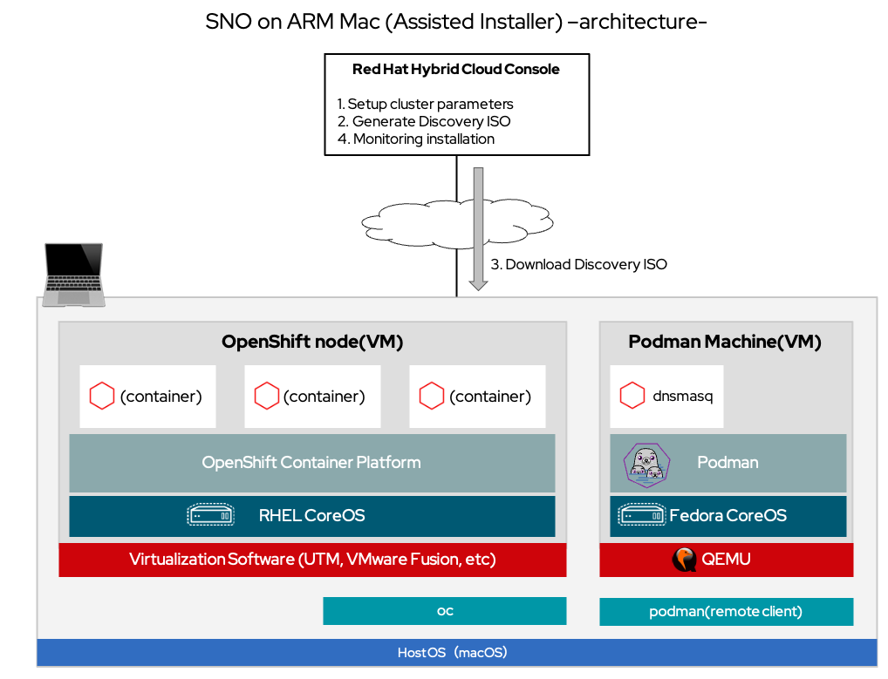

# How to install (for Assisted Installer)
(*) This content is for verification purposes only and does not guarantee use in a production environment or official support.

Install Single Node OpenShift with Assisted Installer on Apple Silicon-based Mac (ARM Mac)

Reference document: 
- [Installing OpenShift on a single node - Installing on a single node | Installing | OpenShift Container Platform 4.12](https://docs.openshift.com/container-platform/4.12/installing/installing_sno/install-sno-installing-sno.html)
- [Assisted Installer for OpenShift Container Platform Assisted Installer for OpenShift Container Platform 2022 | Red Hat Customer Portal](https://access.redhat.com/documentation/en-us/assisted_installer_for_openshift_container_platform/2022/html/assisted_installer_for_openshift_container_platform/index)

## Prerequisites
See [README](../README.md#prerequisites)

## Sample Parameters
See [README](../README.md#sample-parameters)

## Architecture (Assisted Installer)

## Install

Install Single Node OpenShift with Assisted Installer on Apple Silicon-based Mac (ARM Mac)

### 1. 
#### (1) 