# How to install (for Assisted Installer)

Install Single Node OpenShift with Assisted Installer on Apple Silicon-based Mac (ARM Mac)

(*) This content is for verification purposes only and does not guarantee use in a production environment or official support.

Reference document: 
- [Installing OpenShift on a single node - Installing on a single node | Installing | OpenShift Container Platform 4.12](https://docs.openshift.com/container-platform/4.12/installing/installing_sno/install-sno-installing-sno.html)
- [Assisted Installer for OpenShift Container Platform Assisted Installer for OpenShift Container Platform 2022 | Red Hat Customer Portal](https://access.redhat.com/documentation/en-us/assisted_installer_for_openshift_container_platform/2022/html/assisted_installer_for_openshift_container_platform/index)

## Prerequisites
See [README](../README.md#prerequisites)

## Sample Parameters
See [README](../README.md#sample-parameters)

## Architecture (for Assisted Installer)

## How to install (for Assisted Installer)

### 0. Prerequisites

#### (1) SSH public key

Create an SSH key pair by referring to the following document.
- [Generating a key pair for cluster node SSH access](https://docs.openshift.com/container-platform/4.12/installing/installing_platform_agnostic/installing-platform-agnostic.html#ssh-agent-using_installing-platform-agnostic)

#### (2) OpenShift node VM

Create a virtual machine for the OpenShift node in the virtualization software.

#### (3) DNS Server

See [README](../README.md#4-run-the-dns-server)

### 1. Create new cluster

Go to the Assisted Insaller's UI(following link).

- https://console.redhat.com/openshift/create

Switch to the Datacenter tab, and press `Create cluster`.

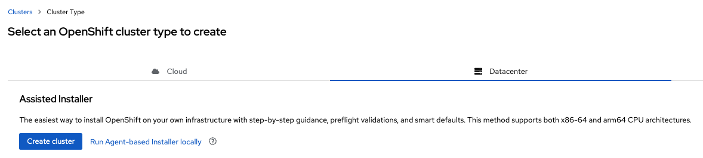

#### (1) Cluster details

| Item| Example Value| Description|
|:-|:-|:-|
| Cluster name| sno| |
| Base domain| home.lab| |
| OpenShift version| OpenShift 4.13.0-rc.7| *required 4.13.0-rc.6 or later|
| CPU architecture| Arm64| |
| Install single node OpenShift(SNO)| Checked| *required|
| Edit pull secret| Unchecked| |
| Host's network configuration| Static IP,bridges and bonds| If you have a DHCP server with Static DHCP leases, you can select `DHCP only`.|
| Encryption of installation disks| Disabled| |

Press `Next` after entering parameters.

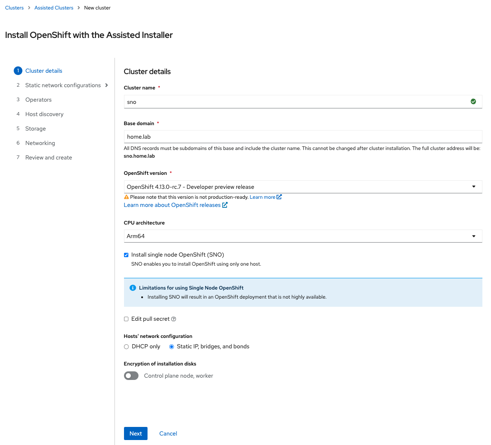

#### (2) Static network configurations

**Network-wide configrations**
| Item | Example Value| Description|
|:-|:-|:-|
| Configure via| Form view| |
| Networking stack type| IPv4| |
| Use VLAN| Unchecked| |
| DNS| 192.168.1.150| |
| Machine network| 192.168.1.0/24| |
| Default gateway| 192.168.1.1| |

Press `Next` after entering parameters.

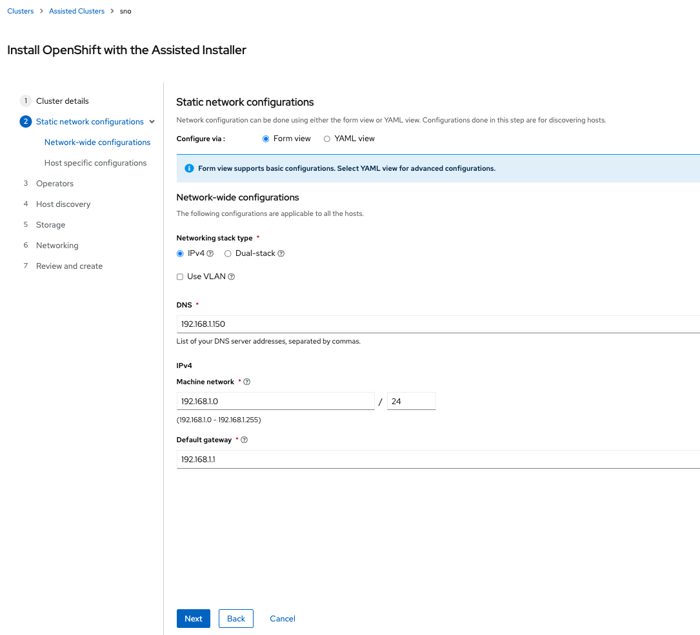

**Host specific configrations**
| Item | Example Value| Description|
|:-|:-|:-|
| MAC Address| 6a:75:4d:0c:7e:a5| See your virtualization software|
| IP address(IPv4)| 192.168.1.40| |

Press `Next` after entering parameters.

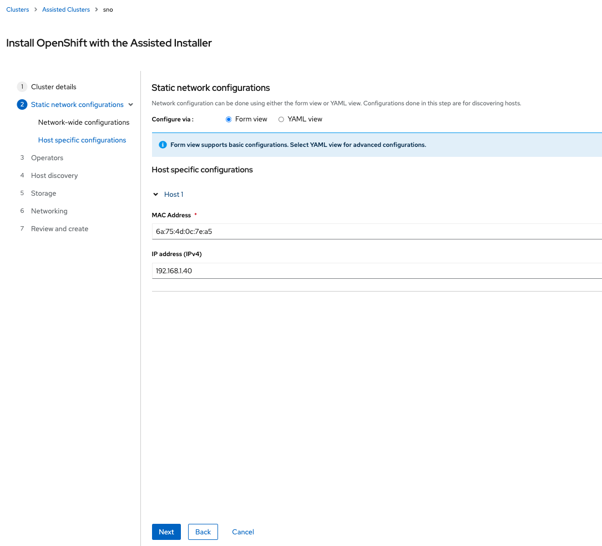

#### (3) Operators

Press `Next`.

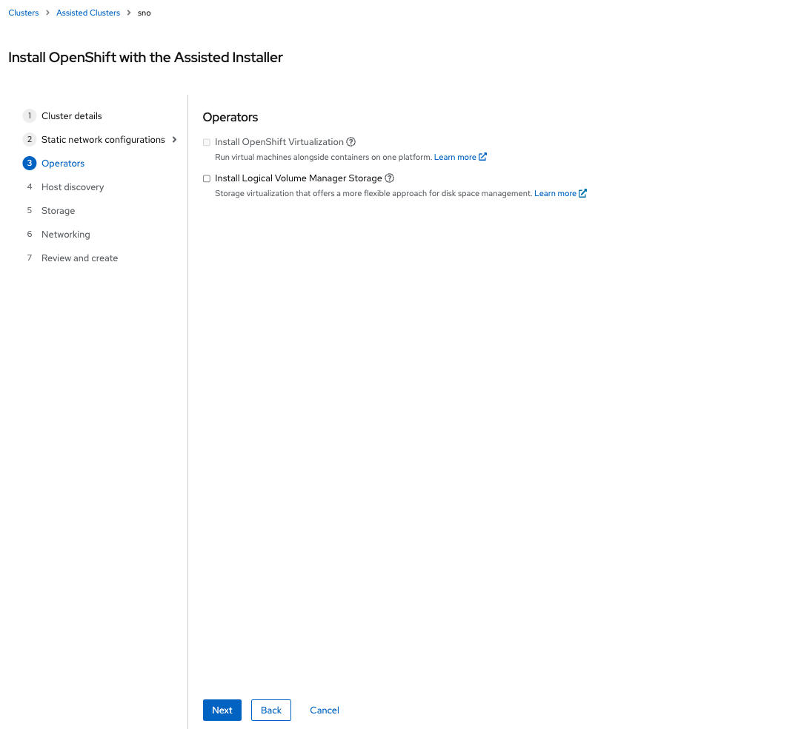

#### (4) Host discovery

Press `Add host`.

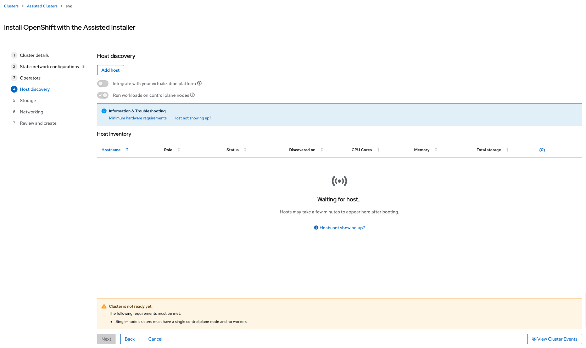

**Add host**
| Item | Example Value| Description|
|:-|:-|:-|
| Provisioning type| Full image file| |
| SSH public key| `<YOUR KEY>`| |
| Configure cluster-wide proxy settings| Unchecked| |
| Configure cluster-wide trusted certificates| Unchecked| |

Press `Generate Discovery ISO` after entering parameters.

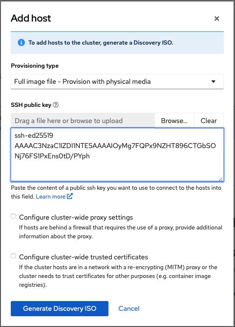

You can download it in two ways.
- from Browser
- from CLI (use wget on terminal)

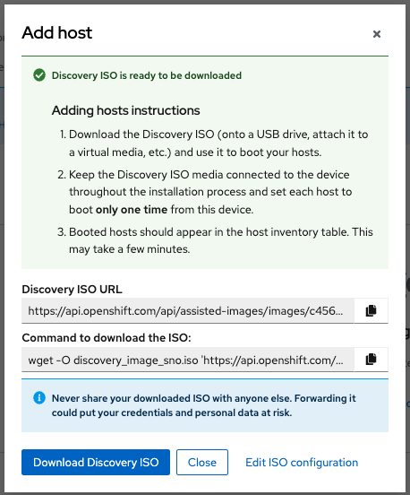

After downloading Discovery ISO, run the ISO in your virtual software and wait for a while. You can see your OpenShift node in the Host inventory.

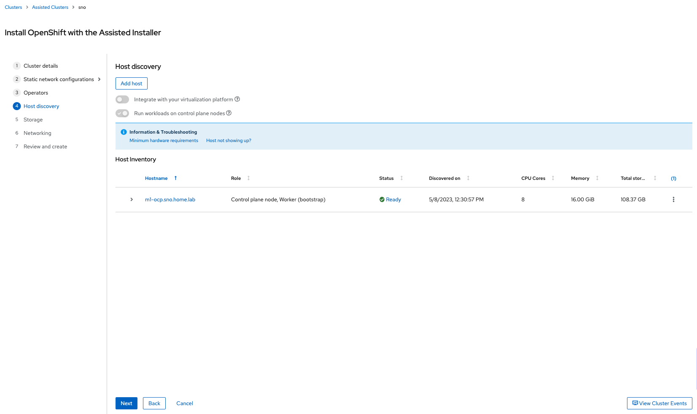

Expand the host name to see the host details.

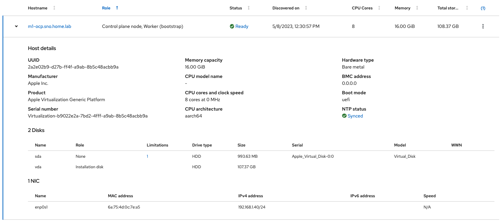
- NTP Status: Immediately after the host is registered, the status may be an error.

#### (5) Storage

Press `Next`.

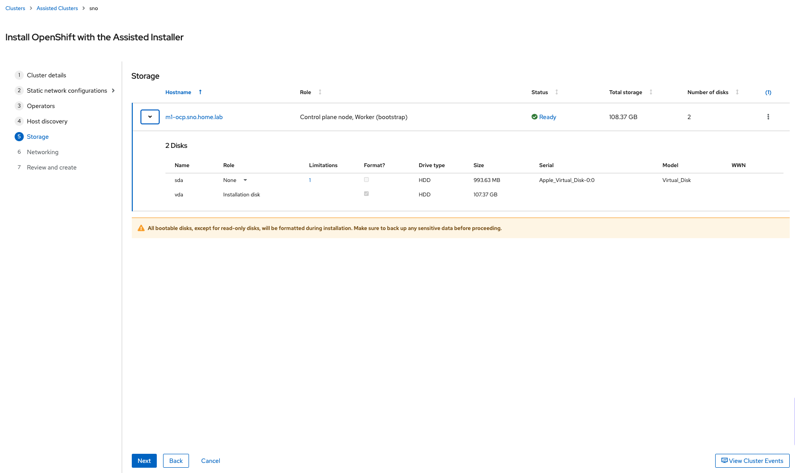
- The total storage size shown will exceed 100GB because the size of the ISO and swap space will be added.

#### (6) Networking

Press `Next`.

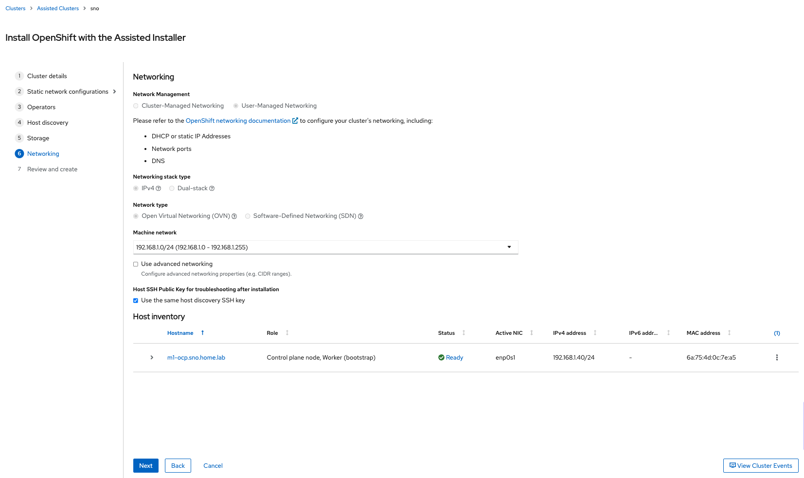

#### (7) Review and create

Confirm the settings and press `install cluster`.

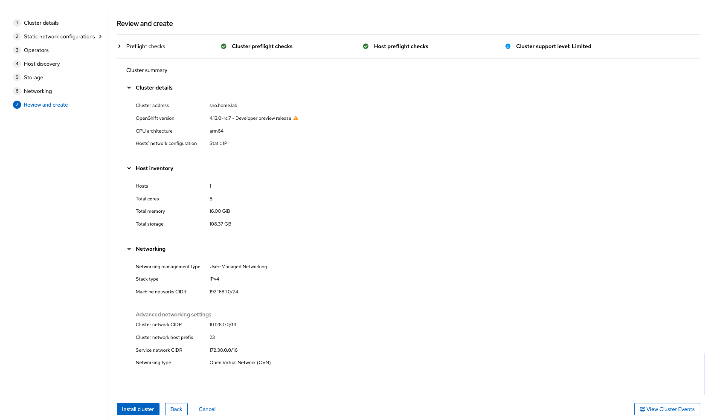

### 2. Monitoring installation

[Install Demo(100x speed)]

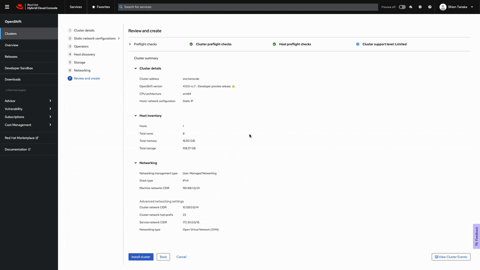

Installation takes approximately 30+ minutes to complete (depending on your machine).

You can access the Web Console using the kubeadmin's password (displayed after the installation is complete).
Press `Download kubeconfig` to obtain the `kubeconfig` file. 
>`kubeconfig` file will only be stored on the Assisted Installer's service for 20 days and will be deleted automatically.

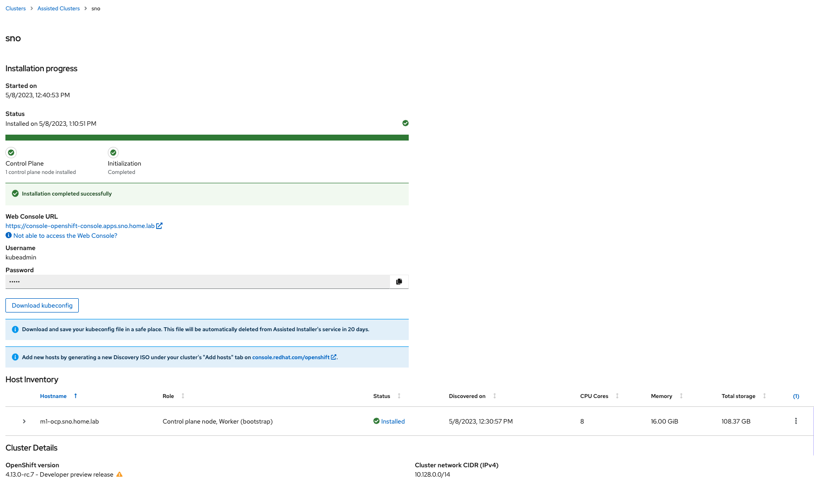