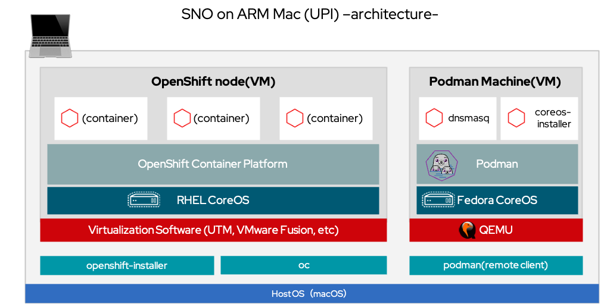

# How to install (for UPI)
Install Single Node OpenShift with UPI on Apple Silicon-based Mac (ARM Mac)

Reference document: [Installing single-node OpenShift manually](https://docs.openshift.com/container-platform/4.12/installing/installing_sno/install-sno-installing-sno.html#installing-single-node-openshift-manually)


## Prerequisites
See [README](../README.md)

## Sample Parameters
See [README](../README.md)

## Architecture (UPI install)



## Install

Install Single Node OpenShift with UPI on Apple Silicon-based Mac (ARM Mac)

### 1. Clone this Git repository
```
git clone https://github.com/tnk4on/sno-on-arm-mac.git
cd sno-on-arm-mac
```

### 2. Get the OpenShift Installer and OpenShift CLI
```
export OCP_VERSION=4.13.0-rc.2
export ARCH=aarch64
mkdir src
cd src
curl -LO https://mirror.openshift.com/pub/openshift-v4/$ARCH/clients/ocp/${OCP_VERSION}/openshift-install-mac.tar.gz
curl -LO https://mirror.openshift.com/pub/openshift-v4/$ARCH/clients/ocp/${OCP_VERSION}/openshift-client-mac.tar.gz
tar zxf openshift-install-mac.tar.gz
tar zxf openshift-client-mac.tar.gz
sudo cp openshift-install oc /usr/local/bin/
cd ..
```

### 3. Get the RHCOS ISO

See [README](../README.md)

### 4. Run the DNS server

See [README](../README.md)

### 5. Change Mac host settings

See [README](../README.md)

### 6. Test boot of the RHCOS ISO and confirmation the device names

See [README](../README.md)

### 7. update install-config.yaml

[Sample: `install-config.yaml`]
```
apiVersion: v1
baseDomain: home.lab
compute:
- name: worker
  replicas: 0
controlPlane:
  name: master
  replicas: 1
metadata:
  name: sno
networking:
  clusterNetworks:
  - cidr: 10.128.0.0/14
    hostPrefix: 23
  machineNetwork:
  - cidr: 192.168.1.0/24
  networkType: OVNKubernetes
  serviceNetwork:
  - 172.30.0.0/16
platform:
  none: {}
bootstrapInPlace:
  installationDisk: /dev/vda
pullSecret: '{"auths":...}' 
sshKey: 'ssh-ed25519 AAAA...'
```

#### (1) Installation disk
Set the value of `installationDisk:` to match the storage device name confirmed in the previous step.
```
bootstrapInPlace:
  installationDisk: /dev/vda
```

#### (2) Pull secret
Download your installation pull secret from the [Red Hat OpenShift Cluster Manager](https://console.redhat.com/openshift/install/pull-secret). And set the value of `pullSecret: ` to the pull secret.
```
pullSecret: '{"auths":...}' 
```

#### (3) SSH key
Reference document: [Generating a key pair for cluster node SSH access](https://docs.openshift.com/container-platform/4.12/installing/installing_platform_agnostic/installing-platform-agnostic.html#ssh-agent-using_installing-platform-agnostic)

Set the value of `sshKey:` to the public SSH key
```
sshKey: 'ssh-ed25519 AAAA...'
```

### 8. Create the Ignition file
```
mkdir ocp
cp install-config.yaml ocp
openshift-install --dir=ocp create single-node-ignition-config
```

### 9. Embed the Ignition file into the RHCOS ISO
#### (1) Register alias command
```
alias coreos-installer='podman run --privileged --rm \
    -v $PWD:/data \
    -w /data quay.io/coreos/coreos-installer:release'
coreos-installer --version
```

#### (2) Embed the Ignition file
```
coreos-installer iso ignition embed -fi ocp/bootstrap-in-place-for-live-iso.ign iso/rhcos-live.iso
```

### 10. Static IP address configuration for OpenShift nodes

#### (1) Set the environment variables

```
export IP=192.168.1.40
export GATEWAY=192.168.1.1
export NETMASK=255.255.255.0
export INT=enp0s1
export HOSTNAME=m1-ocp.sno.home.lab
export DNS=192.168.1.150
```

#### (2) Set the kernel arguments for ISO

```
coreos-installer iso kargs modify -a "console=ttyS0 rd.neednet=1 ip=${IP}::${GATEWAY}:${NETMASK}:${HOSTNAME}:${INT}:none nameserver=${DNS}" iso/rhcos-live.iso
```

### 11. Boot the RHCOS ISO

Start the virtual machine using the `iso/rhcos-live.iso`. After the ISO is booted, the installation of the cluster will start automatically.

#### Automatic reboot during installation
During the automatic execution of the installation, the system will reboot twice at the following times.

- 1st: ISO start → After completion of writing to disk
- 2nd: Bootstrap start → after Bootstrap completion

#### Installation status monitoring

```
export KUBECONFIG=ocp/auth/kubeconfig
openshift-install --dir=ocp wait-for bootstrap-complete
```
- `wait-for bootstrap-complete` from ISO startup to Bootstrap completion.

#### Confirm Completion of Installation
Run the following command to confirm that the cluster installation is complete.

```
openshift-install --dir=ocp wait-for install-complete
```

The password for `kubeadmin` can be found in the log output after the installation is complete.
```
~~~~
INFO Install complete!                            
INFO To access the cluster as the system:admin user when using 'oc', run 'export KUBECONFIG=/Users/*****/***/ocp-on-arm-mac/ocp/auth/kubeconfig' 
INFO Access the OpenShift web-console here: https://console-openshift-console.apps.sno.home.lab 
INFO Login to the console with user: "kubeadmin", and password: "BJpWp-8dGqa-XNGoW-vzGfV" 
```

### Resetting the Environment
If there are problems with the installation, delete the installation directory and start over with the creation of the Ignition file. 

Delete the installation directory
```
rm -rf ocp
```

Initialize the ISO image
```
coreos-installer iso reset iso/rhcos-live.iso
```